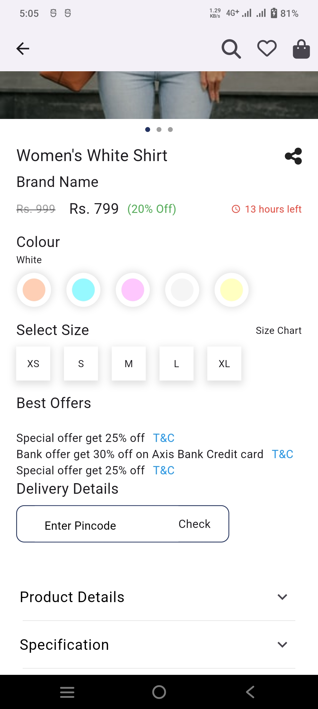

# E-Commerce Application

This is a Flutter-based e-commerce application designed to provide a seamless shopping experience. The app features product listings, a carousel for promotions, pincode validation for delivery, and an FAQ section among other functionalities.

## Table of Contents
- [Features](#features)
- [Screenshots](#screenshots)
- [Installation](#installation)
- [Dependencies](#dependencies)

## Features

- **Product Listings**: Browse a variety of products with details.
- **Promotional Carousel**: View promotional offers through a carousel slider with indicator.
- **Pincode Validation**: Enter and validate pincode for delivery.
- **FAQ Section**: Find answers to common questions with an expandable FAQ section.

## Screenshots

<style>
        img{
            display: inline;
        }
 </style>
    
### Login Screen


### Home Screen


### Product Details




## Installation

**Step 1: Clone the repository:**
   ```sh
   https://github.com/nishant-bhandigare/aibuddha-Assignment.git
   ```

**Step 2: Navigate to the project directory:**
   ```sh
   cd aibuddha-Assignment
   ```

**Step 3: Install dependencies:**
   ```sh
   flutter pub get
   ```

**Step 4: Run the app:**
   ```sh
   flutter run
   ```
    
## Dependencies

- **carousel_indicator**: ^1.0.0
- **carousel_slider**: ^4.0.0
- **flutter**: ^2.0.0
- **font_awesome_flutter**: ^9.0.0

## Acknowledgements

 - Thanks to the Flutter community for their support and contributions.

